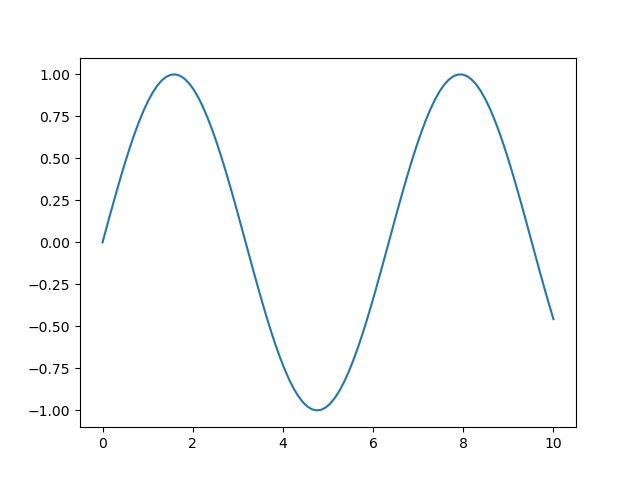
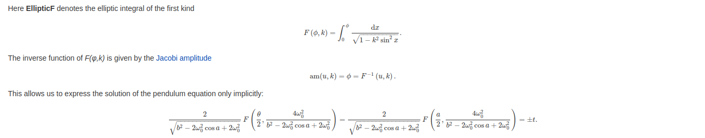
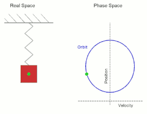

# Table of Contents

1.  [Movimiento armónico simple (M.A.S) &lt;2023-02-02 jue&gt;](#org6592b46)
    1.  [Péndulo](#orgad3321a)
        1.  [Péndulo simple](#org048df5d)
        2.  [Gráfica del ángulo](#org4b6a0d2)
        3.  [Simulador interactivo](#org1fa2987)
        4.  [Solución exacta [OPCIONAL]](#org735e719)
        5.  [Péndulo doble](#org2595f05)
    2.  [Sistema masa resorte](#org0ed2699)
    3.  [Ejercicios](#org7753655)

Esta es la serie de notas de física realizadas para el primer periodo.

# Movimiento armónico simple (M.A.S) &lt;2023-02-02 jue&gt;

Es un movimiento periódico en el que un cuerpo oscila respecto a su posición de equilibrio a intérvalos iguales de tiempo.

    - Manecillas del reloj
    - Péndulo simple
    - Movimiento de un cuerpo sujeto a un resorte.
    
    Estos ejemplos ignoran la fricción del aire, por eso se llaman modelos simples.

Todo M.A.S tiene una posición de equilibrio respecto a la cual el movimiento es simétrico.

## Péndulo

### Péndulo simple

Ejemplo de péndulo simple.

-   ¿Es un movimiento armónico simple?
-   ¿ Por qué es armónico o simple?

La ecuación del péndulo simple es después de la resolución de las ecuaciones:

\begin{equation}
\theta (t) = sen\left( \sqrt{\frac{g}{l}} \cdot t \right)
\end{equation}

El periodo queda de la forma,

\begin{equation}
\mathrm{T} = 2\pi \sqrt{\frac{l}{g}}
\end{equation}

Los siguientes son datos de ejemplo calculados a partir de la ecuación del periodo.

<table border="2" cellspacing="0" cellpadding="6" rules="groups" frame="hsides">

<colgroup>
<col  class="org-right" />

<col  class="org-right" />

<col  class="org-right" />

<col  class="org-right" />
</colgroup>
<thead>
<tr>
<th scope="col" class="org-right">L(m)</th>
<th scope="col" class="org-right">g(m/s²)</th>
<th scope="col" class="org-right">M(kg)</th>
<th scope="col" class="org-right">T(s)</th>
</tr>
</thead>

<tbody>
<tr>
<td class="org-right">7</td>
<td class="org-right">9.8</td>
<td class="org-right">10</td>
<td class="org-right">5.3102608</td>
</tr>

<tr>
<td class="org-right">4</td>
<td class="org-right">9.8</td>
<td class="org-right">6</td>
<td class="org-right">4.0141798</td>
</tr>

<tr>
<td class="org-right">8</td>
<td class="org-right">12</td>
<td class="org-right">10</td>
<td class="org-right">5.1301993</td>
</tr>

<tr>
<td class="org-right">31</td>
<td class="org-right">9.8</td>
<td class="org-right">0</td>
<td class="org-right">11.175004</td>
</tr>

<tr>
<td class="org-right">8</td>
<td class="org-right">9.8</td>
<td class="org-right">0</td>
<td class="org-right">5.6769076</td>
</tr>

<tr>
<td class="org-right">6</td>
<td class="org-right">9.8</td>
<td class="org-right">0</td>
<td class="org-right">4.9163462</td>
</tr>

<tr>
<td class="org-right">12</td>
<td class="org-right">9.8</td>
<td class="org-right">0</td>
<td class="org-right">6.9527634</td>
</tr>

<tr>
<td class="org-right">50</td>
<td class="org-right">9.8</td>
<td class="org-right">0</td>
<td class="org-right">14.192269</td>
</tr>

<tr>
<td class="org-right">60</td>
<td class="org-right">9.8</td>
<td class="org-right">0</td>
<td class="org-right">15.546852</td>
</tr>

<tr>
<td class="org-right">5</td>
<td class="org-right">9.8</td>
<td class="org-right">0</td>
<td class="org-right">4.4879895</td>
</tr>

<tr>
<td class="org-right">9</td>
<td class="org-right">9.8</td>
<td class="org-right">0</td>
<td class="org-right">6.0212698</td>
</tr>
</tbody>
</table>

[Página del código](https://scipython.com/book2/chapter-7-matplotlib/problems/p77/animating-a-pendulum/)

    python3 programas/pendulo_simple.py -dt 0.01 -l 9 -g 9.8 -o 7.14

El péndulo simple presenta un movimiento periódico y su periodo aumenta conforme aumenta su longitud, así como disminuye si la gravedad del sistema aumenta.

El periodo en el péndulo simple representa el tiempo en que el sistema tarda en realizar una oscilación completa. 

La solución anteriormente vista es una aproximación para el caso en que el péndulo simple tiene valores de angulo inicial pequeños. 

### Gráfica del ángulo

    import numpy as np
    from matplotlib import pyplot as plt
    
    t = np.linspace(0,10,100)
    y = np.sin(np.sqrt(9.8/10)*t)
    
    plt.plot(t,y)
    
    plt.savefig("./imagenes/angulo.png")
    
    return './imagenes/angulo.png'

Podemos ver que la gráfica es la gráfica de una función seno, ya que el angulo está descrita por esta función.

### Simulador interactivo

Entren a esta página donde pueden jugar y practicar con el péndulo:

[Simulador pendulo](https://phet.colorado.edu/sims/html/pendulum-lab/latest/pendulum-lab_es.html)

### Solución exacta [OPCIONAL]

La solución exacta a la ecuación del péndulo la pueden encontrar en este link: [Solución exacta](https://www.cfm.brown.edu/people/dobrush/am33/Mathematica/ch4/solution.html)

Les ahorro entrar a la página,

**¿De verdad quieres saber?**
Entonces mira este video

[explicación en video (Inglés)](https://www.youtube.com/watch?v=efvT2iUSjaA)

### Péndulo doble

    python3 programas/pendulo_doble_2.py

Podemos notar que no todo péndulo genera un movimiento armónico simple.

## Sistema masa resorte

-   ¿Cual es el movimiento de un sistema masa resorte?
-   ¿ Que diferencias tiene con un péndulo?
    -   Se parecen en que tiene oscilaciones
    -   ambos tienen un MAS.

Utilizaremos un sistema sin fricción. Los sistema  masa-resorte consisten en que un cuerpo de cierta masa está atado a uno de los extremos de un resorte y el cuerpo está sometido a alguna fuerza externa. Usualmente en sistemas simples, no se considera la fricción del aire ni la masa del resorte.

1.  Constante K

    La constante K o constante del resorte. Se denomina la constante elástica del resorte, y relaciona la fuerza que ejerce un resorte con respecto a su distancia de elongación.

2.  Expresión de la Fuerza

    \begin{equation}
    F = k \cdot x
    \end{equation}
    
    Donde k, es la constante de resorte y, x es la distancia de enlongación respecto al punto de equilibrio.

3.  expresión de la posición respecto al tiempo

    \begin{equation}
    x(t) = Asin(w \cdot t + \phi )
    \end{equation}
    
    Esta es la definición del movimiento del resorte con respecto al tiempo.
    
    -   A es la amplitud del movimiento y da razón de que tanto se elonga o comprime el resorte.
    -   w es llamada, frecuencia angular y determina el periodo del movimiento.
    -   $\phi$ es llamada fase inicial, y define la posición inicial del movimiento.

## Ejercicios

1.  Determina la ecuación representativa de un movimiento armónico simple sabiendo que la separación máxima a la posición de equilíbrio es de 20 cm y se han contado 25 oscilaciones en 5 segundos partiendo del equilibrio.

2.  Se cuelga un objeto de 200 g de un resorte sujeto al techo de 35 cm de longitud y su nueva longitud es de 45 cm.
    -   Determina la constante de elasticidad k del resorte
    -   Si estiramos el resorte hasta que mida 55 cm y lo soltamos, determina las fuerzas que actúan sobre el resorte.

3.  Determina cual debe ser la amplitud de las oscilaciones de un péndulo de 70 cm sabiendo que el máximo ángulo que separa el hilo de la vertical es de 6º. ¿Qué fuerzas actúan sobre el cuerpo en esa situación suponiendo una masa de 80 g?

4.  ¿Cual será la gravedad en un planeta en el que un péndulo de longitud 10 cm tarda 0.634 segundos en realizar una oscilación completa?

5.  Una partícula de m=200 g de masa unida a un muelle horizontal, realiza un movimiento armónico simple siendo la frecuencia angular ω=100 rad/s. Sabemos que en el instante t=0, la posición inicial −0.5√3cm, y la velocidad inicial de la partícula es 50 cm/s.
    -   Escribir la ecuación del MAS
    -   Calcular la constante elástica del resorte.

