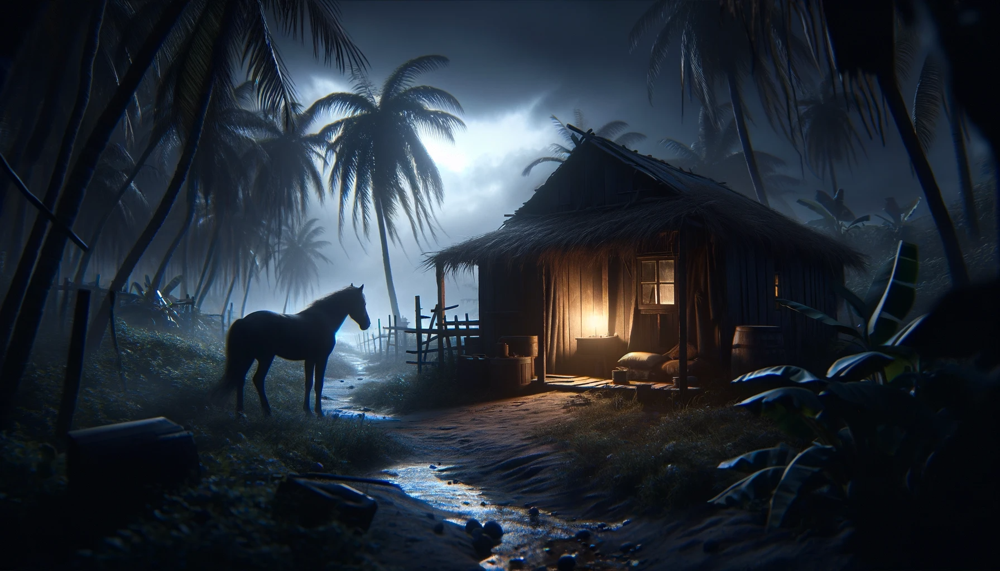
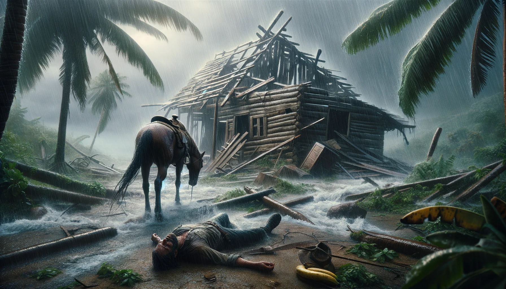

# Table of Contents

SUEÑO

Todo es desde siempre. Nada que no es, nunca será.

Es la tarde una brisa mortuoria, allí se van anidando las esperanzas. Ese día los cielos solo habían enviado desgracias. El hombre había llegado cansado a su casa encorvado como si cargara el peso de todas sus frustraciones, se había arrastrado por los caminos de tierra en su caballo con el sol bañándole la frente. Cuando se bajó del lomo de la bestia, esta lo miró triste como diciéndole “Dame algo de esa carga que llevas, que te aplasta”. El día lo había tratado como a un esclavo, su pago fue un  cansancio enorme, porque todo el trabajo fue en vano. Entró a la cabaña inundada de negro, encendió una vela, y se tiró a la muerte en la camita del piso.

Afuera la brisa reventaba en las palmeras, en las matas de plátano, envolvía y desenrollaba las frustraciones que habían quedado en el lomo del caballo. Dormía la muerte del fracaso el hombre tirado en el piso. Afuera la brisa seguía temblando en las varetas de la cabaña.

Es la vela apenas un escudo a la nada, la intemperie es el universo acechando en las esquinas. Se apaga. Aún hay mucha muerte que dormir todavía. El agua cae del cielo por mandato del infierno, se filtra en las cabañas como castigo.

El agua le corrió en la cara y le lavó el sudor de las cejas, la brisa arrebató su techo igual que el día había menospreciado sus fuerzas, la intemperie lo maltrató de lleno, la oscuridad se le metió en los ojos y vio la nada. La nada es el vacío que te arropa frío como un manantial de gotas rodeandote el cuerpo, es el sonido con que ruge la lluvia que condena a los que duermen. La nada se le metió a los ojos tan profundo que pensó jamás poder volver a ver, y se imaginó que la muerte lo encontraba entre las ruinas de la cabaña, tirado. Abrió los ojos grandes, grandes y sintió las gotas golpeandole las pupilas, se volteo boca abajo y durmió la muerte que le faltaba dormir, mientras el caballo lo miraba como quien no entiende.

Se despertó porque una luz intensa le atravesaba los párpados. Vio su cabaña en ruinas, y se estrelló con la mirada fija del caballo bajo el techo intacto de su establo. La lluvia había cesado peró aún quedaban enredados sonando por las hojas de los plátanos algunos soplos del viento frío, el viento frío envolviendole los brazos, y el viento frío restregándose en su cara y su ropa mojada. Se paró y notó que el cielo apenas empezaba a aclararse. Descansar debe ser para los que lo merecen. Caminó al establo y vio la luz lejana reflejandose en los ojos del caballo, tanto que pensó que el animal se quemaba por dentro y por los ojos le salían las llamas. Alrededor, estaban las tablas de su cabaña enterradas en el barro, los platos de arcilla partidos en pedazos, y pensó que dios lo estaba tratando como a un esclavo. Miró la luz, se tocó la cabeza y se percató que le sangraba la frente, lo inundaba un dolor profundo en el cerebro. Caminó hacia ella y pensó que dios lo había vendido al infierno. Regresó la mirada al establo, vió los ojos en llamas del caballo y este le hizo un gesto como quien advierte: “Allí donde no debe haber luz toda luz será un engaño”.

Continuó, la luz se hizo grande y blanca, los párpados le temblaban con los ojos entrecerrados. La luz eran dos luces grandes como dos estrellas blancas frente a su rostro, detrás una caja negra que reflejaba a veces el cielo, a veces las luces. De la caja emergió un hombre con un vestido blanco, tenía en sus manos otra luz blanca pero más pequeña, lo miró y le dijo,

¿Quieres saber el futuro?

El Hombre quedó paralizado, como si el viento frío le hubiese congelado la ropa mojada. Se quedó inmerso en el resplandor blanco que salía de la mano.

¿Quieres saber el futuro?

La pregunta le retumbó sin ningún sentido, igual que los ruidos del bosque, como los gritos perdidos que trae el viento sin significados.

Todo es, desde siempre, nada que no es, nunca será. - Continuó el hombre, y la luz de su mano se apagó.-

Entonces, como despertando de un sueño profundo cayó en el mundo, sintió la ropa mojada pegada al cuerpo, la sangre corriéndole en la frente, el cuerpo tiritando en frío. Vio la caja negra y las dos velas grandes y pensó  que debía ser el funeral de un ángel.

Que si quieres saber el futuro

Miro al tipo a los ojos y vió la cara arrugada por los años pero limpia y tersa como el que nunca ha conocido el sol,

¿El futuro?.
Si, el futuro, tu futuro, ¿quieres saberlo?.

Miró atrás y vio el brillo en los ojos del caballo, la cabaña hecha trizas y recordó que dios lo había estado tratando como a un esclavo los últimos treinta años, se vió a sí mismo en el lomo de la bestia por los siglos de los siglos absorbiendo todo el sol del mundo en la cara y regresando cada noche a dormir el cansancio al lado de la vela. pensó en morir y dijo:

Dime Angel, ¿cuándo dios me mandará a buscar?.
¿Te refieres al día de tu muerte?.

Asintió. El caballo relinchó a lo lejos, el relincho le pareció el grito de dolor de un niño. Vio al caballo con los ojos en fuego intentando escapar del establo.

Pues bien, te vas a morir mientras duermes, te quedan dos sueños más, sin contar este.

El ángel se metió a la caja y las dos velas blancas se alejaron alumbrando el camino, la caja se alejó con ellas bramando como diez reses juntas.

El hombre se acostó, miró el cielo, y tuvo la sensación de que todo fue un sueño, de que aún dormía; fijó la vista en la luna que se asomaba pequeña detrás de un nubarrón, vio al caballo fuera del establo con los ojos negros, tanto que parecía que solo tuviera cuencas, y se quedó dormido en el barro.

Se despertó porque el sol le estaba quemando la frente, abrió los ojos, y sintió como el barro seco le pegaba el cachete a la tierra. Se levantó lentamente para no lastimarse el rostro. Ya de pie, vio el barro manchado de rojo y un charco de sangre seca en el hueco que hizo su cabeza mientras dormía. Se tocó la frente y sintió el barro cubriendole la herida. Entonces no pudo evitar pensar que todo había sido un sueño. Sentía el dolor de cada parte minúscula del cuerpo. Aún tenía la ropa húmeda pegándose y raspandole la piel con la tierra que había juntando en la jornada. Volvió la vista a la cabaña, lo único que vio fueron tablas y palos esparcidos en la tierra, se imaginó las palmas del techo volando sobre los árboles del bosque y posándose en la mitad de un mar tranquilo, lejano. Vió el establo vacío y pensó que su caballo había sido tal vez llevado por la tormenta. Imaginó al caballo navegando sobre el techo en la mitad del mar tranquilo. Luego lo vio acercándose suave por el camino, como si llevara una carga inmensa sobre el lomo, de lejos el caballo lo miraba con tristeza y él pensó que le estaba reclamando por levantarse tan tarde. Buscó el sol haciéndose sombra con las manos. Calculó las once de la mañana. Miró al caballo que ahora comía pasto en el borde del camino y lo vió parado sobre dos líneas gruesas como rastros de arado. Entonces recordó el sueño del futuro y su muerte, se le vino la imagen vivida del caballo con los ojos en llamas y las dos luces blancas flotando en la madrugada. La noche se había tornado un castigo, la brisa se había llevado junto a su cabaña, todo frágil anhelo de que la mañana le ofrecería algún día alguna dicha. Siempre había pensado la vida como un declive a la muerte y ahora se sentía el declive mismo embarrandose las botas, sorbiendo el aire espeso que había dejado la tormenta, el sabor a hierro en las comisuras de los labios, dudó de ese sueño en que un ángel le decía su muerte y se pensó muerto; se estrelló con la mirada de lástima del caballo y se supo vivo.

Recogió los pedazos de madera que habían quedado esparcidos en la tierra. Cuando los amontonó al lado del establo se entendió acabado, supo que de alguna u otra manera la muerte lo estaba llamando. No pueden ser coincidencias treinta años de tristezas, la vida es como una condena lenta, una enfermedad que va comiendo todo ánimo poco a poco hasta dejarte sin fuerzas. Tomó al caballo por las cuerdas que le guindaban del cuello y se montó a su lomo sin silla, porque seguramente las brisas habían tirado la silla a algún rincón remoto, también tranquilo.

Partió rumbo al mercado de un caserío cercano queriendo nuevamente encontrar señales de vida. Estaba acostumbrado a pasar meses enteros sin relacionarse con la gente del pueblo, evitaba encontrarlos en los caminos, porque se avergonzaba de que vieran su tristeza que parecía un tatuaje en el rostro. Ya lejos miró atrás y vio como su casa se hacía pequeña en la distancia, pensó que se estaba alejando de una gran miseria. Cuando llegó, oyó los rumores de los comerciantes hablando de un hombre que había estado adivinando el futuro de la gente. Las historias del adivino le revolvían los recuerdos, en cada palabra veía la noche feroz que le acababa de drenar las fuerzas, la luz blanca pequeña que emergía de la mano de aquel hombre y la brisa fría congelandole el cuerpo, escuchaba otra vez el sonido de la caja negra como la de una manada de reses, y se convenció que no había sido un sueño. Miró el sol, calculó las cinco de la tarde. La gente empezaba a irse y los murmullos empezaban a desvanecerse, la brisa aumentaba y sintió miedo de que otra noche terrible lo alcanzara ahora vagando sin refugio en medio del bosque o tirado al borde de algún camino. Miró al caballo a los ojos, y le pareció escuchar claramente la voz quebrada del animal diciéndole, “Te quedan dos sueños, y luego la muerte”. La sangre le corrió caliente por el cuerpo, tan caliente que lo despertó del letargo que lo había mantenido inmutado hasta entonces. Pensó en la muerte como una figura sin forma, grande y negra llevandoselo al infierno. Todo el dolor del cuerpo se le convirtió en un terror profundo. Se imaginó a esa muerte acorralandolo de madrugada tirado en algún camino mientras dormía y arrastrandolo hacia las profundidades del mundo. Luego pensó que era dios quien lo mataba a sangre fría, y llegó a concluir que la muerte y dios debían ser lo mismo. Se montó al caballo, echó a correr y ya lejos del caserío gritó con lágrimas en los ojos, hasta que le ardió la garganta. El animal relinchó al tiempo y él oyó el relincho como un grito de victoria, como si la bestia añorara su muerte.

Padre, estoy que me muero. Un ángel vino a decírmelo.
Los perros no lo dejaron bajar del caballo, y su padre lo retuvo en el portón de la entrada sosteniendo una vela.
Padre, este animal necesita un descanso, lleva horas andando. Permíteme al menos darle agua.
Dale agua al caballo y vete.

Sintió los ojos pesados, y hondos colgandole en el rostro, la brisa era entonces un murmullo tenue. Llevó al caballo a la alberca y el ladrido de los perros se fue haciendo cada vez más pequeño. Las siluetas de los árboles de mango le recordaron su infancia y no pudo evitar llorar. Se lavó la tierra del cuerpo y se acostó en silencio. Sintió tener el sueño de todos los vivos en los ojos.

Vio la luna grande y blanca en el cielo como un ojo vigilando en las tinieblas. Empezó a escuchar de repente ladridos suaves que se fueron haciendo más grandes hasta tenerlos golpeándole la oreja. La silueta de su padre se dibujó en las sombras y le dio un papel doblado.

Acá te manda tu madre, ahora vete.
Vine hasta acá a hablar con ustedes, estoy a punto de morirme.
¿Cuándo?.
Mientras duerma, el adivino dijo dos sueños, pero he dormido un poco en el camino. Creo que si me duermo ahora me muero. Quiero hablar con ustedes, creo que he cumplido.

La muerte debe ser toda noche en que la luna llena alumbra a los perros ladrándo a los intrusos que antes fueron hijos.

Entonces creo que puedes dormir en el cuarto de tu hermano por esta noche.
No quiero dormir todavía, siento que me falta algo. Además necesito hablar con ustedes.
Vete de una vez y deja de estarme jodiendo.

La silueta de su padre se perdió entre las sombras de los mangos. Se acostó y vio en el cielo todo el horror de sus años trabajando bajo el sol, toda la furia de dios sobre sus hombros. Se levantó, tomó la carta de papel con ambas manos y se dispuso a esperar el día. Jaló al caballo por las cuerdas y se echó a andar.

Titilaban algunas luces lejanas a la distancia.

Estuvo recitando rezos para no dormir hasta que el sol alumbró lo suficiente. Tomó el papel y lo abrió con las últimas fuerzas que le había dejado la noche. El diablo y el sueño deben ser lo mismo. Los ojos pesados se le cerraban de a poco y le costaba leer, puso el papel en el suelo porque las manos le temblaban, y leyó.

Su madre había muerto hacía seis meses y lo perdonaba en la carta. “ Para cuando esta carta te llegue ya estaré muerta, te perdono hijo, creo que me falta perdonarte para ir al cielo, pero no quiero verte”. Le hablaba de otras tantas cosas, del dolor profundo que había tenido en el pecho cuando se fue, y que las pocas veces que lo había vuelto a ver se le revolvía el estómago. Que no había tenido fuerzas para perdonarlo, pero un ángel una noche le dijo que tenía que hacerlo. Los ojos cansados se le hincharon en lágrimas. Vio al caballo dormido a su lado y se le vino la imagen de su madre abrazándolo cuando era un niño. Cerró los ojos y durmió tirado al borde del camino.

Se despertó porque sintió que alguien le puyaba las costillas,

¡Muchacho, muchacho!

Se retorció en el suelo, estiró los brazos y vió a un hombre a caballo puyandolo con un palo.

Muchacho, pensé que estabas muerto muchacho, ahí tirado en el suelo, y el caballo como si hablara, relinchando como si llorara.

Sintió un calor tenue en la frente, y el resplandor del sol lo obligaba a entrecerrar los ojos. Calculó que debían ser las nueve de la mañana. Sentía los ojos como dos cargas inmensas jalándole el rostro a la tierra. Buscó al caballo con la mirada, y cuando lo vio, este relinchó como si llorara.

¿Si escuchaste?, ese caballo llora muchacho… Mijo, me he quedado esperandote para trabajar y no has venido. Ayer fui a tu casa y estaba todo tirado, ¿donde has estado?. Hay que terminar el potrero.

Poco a poco la luz le fue abriendo los ojos, se sentó en la tierra y le pareció cargar con todo el cansancio del mundo. Sintió que el cuerpo le temblaba y no escuchaba nada, excepto la voz del hombre que lo miraba fijo desde el caballo.

¡Muchacho, muchacho!
Patrón, yo me voy a morir patrón, me voy a morir patrón, me tengo que morir, y no se pa’ que me va servir el trabajo.

Vió como al patrón le cambiaba el rostro, las cejas se le alzaron y los ojos se le abrieron tanto que le pareció que podían caerseles.

Tu tienes que morirte y yo también muchacho, pero antes de morirte tienes que terminar el potrero.

Miró al caballo y este relinchó de nuevo, pero el relincho le pareció una burla.

Ese caballo llora muchacho, si no fuera caballo diría que está llorando de verdad.

Vio los ojos negros del animal y recordó el pensamiento en que la muerte lo llevaba a las profundidades del infierno y la imaginó con la cara de su patrón. A Dios le deben de sobrar demasiadas desgracias. Se le vino el recuerdo de la noche férrea donde la tormenta le arrebató la cabaña, y lo entendió como una antesala al descanso. Entonces se proyectó arreglando el potrero como su último esfuerzo y se supo un prisionero cercano a la libertad. Se montó al lomo sin silla del caballo, y empezó a andar al lado del patrón sin decir palabra.

La mañana se fue calentando lento, sintió el cuerpo pesado como nunca antes, como si ahora dios descargara todas las frustraciones de los vivos en sus hombros. Poco a poco el sudor le fue empapando la ropa, sus movimientos fueron cada vez más lentos y los ojos entrecerrados le rogaban descanso. A la hora del almuerzo no quiso comer por terminar el trabajo lo antes posible. Quiso quedarse dormido en el suelo, pero pensó en la muerte llevándoselo al infierno. Luego pensaba en la muerte condenandolo a repetir su vida por la eternidad. El sueño lo cobijó completo durante toda la jornada hasta que terminó el potrero. Vió el sol, calculó las cinco de la tarde. Escuchó a su patrón decirle algo, pero pensó que todo estaba listo y se montó sin voltear al caballo. Miró el potrero, vio al patrón que le hacía un ademán con su sombrero, entendió que le permitía irse. La muerte no te debe encontrar en tierra ajena. Sentía que iba arrastrando los ojos y las imágenes se le superponían, golpeó con las espuelas al caballo y este empezó a andar.

Iba mirando el sol para no caer en sueño, calculó las seis de la tarde cuando llegó a su antigua cabaña. Vió los palos amontonados al lado del establo y los pedazos de arcilla tirados en el piso, pensó que estaba entrando a una grán miseria. Se lanzó del lomo del caballo y cuando cayó, la bestia le olfateó las piernas y a él le pareció que el animal sentía una genuina lástima por él. Acostado boca arriba miró con los ojos casi cerrados la media luna blanca que se pintaba en el cielo aún azul. Imaginó a dios y la muerte recogiendolo de entre esas ruinas y llevándolo a un rincón tranquilo del mundo. Le pesaban los ojos y sentía las manos temblando. Empezó a pensar que quizás no había alcanzado redención y le atravesó por el cuerpo un terror profundo. Tienen que ser suficientes treinta años de miserias. En el cielo le pareció ver la forma de unas palmas volando, la brisa que le sobaba el cuerpo las mantenía en el aire. Las palmas se fueron acercando y supo que eran parte del techo que la tormenta le había robado antes. Sintió que el peso de los ojos era mucho y empezó a cerrarlos. Alcanzó a ver como las palmas del techo se acercaban veloces hacia su rostro y le pareció que eran el arma de la muerte. Sintió el terror gigante del que será asesinado, su cuerpo se movió en espasmo y sintió el dolor de cada músculo. Cerró completamente los ojos y empezó a divagar entre pensamientos sin sentido. Escuchó suave un sonido parecido al de una manada de reses y se le vino por un instante la imagen del ángel prediciendo su muerte, tuvo un espasmo repentino de terror, sintió una punzada profunda en el corazón y se fue quedando dormido en la tierra.

El caballo lo contemplaba tendido en el suelo, lo veía revolcarse rápido como una serpiente. Escuchó el sonido de las reses, vió como la caja negra se acercaba bramando y salía de ella un hombre vestido de blanco. Vio la boca del hombre abrirse y cerrarse y su voz decía cosas que no entendía. El hombre movía sus manos sobre un objeto blanco e iba dibujando líneas. Comprendió entonces que a su amo le había llegado la muerte y sintió como si de la espalda se le cayera un gran peso. Se alejó hacia el bosque porque la caja negra le producía terror. Ya entre los árboles miró atrás y vió al hombre de blanco mirándole fijamente con la misma mirada que tenía su amo, como quien no entiende.

